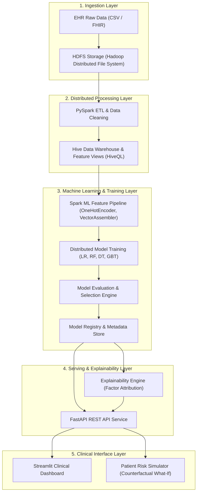

# System Architecture — Hospital Readmission AI

> **Status:** System Architecture Specification  
> **Target Version:** `2.0.0`


---

## 1. High-Level Architectural Flow

The system implements an end-to-end distributed data processing and machine learning pipeline designed to scale across large EHR datasets:



---

## 2. Architectural Layers

### 2.1 Data Layer
- **Distributed Storage:** Apache Hadoop HDFS acts as the central data lake for raw encounter datasets, staging files, and partitioned parquet outputs.
- **Data Partitions:** Raw data ingested into `/data/raw`, cleansed records staged in `/data/processed`, and sample test records preserved in `/data/sample`.

### 2.2 Processing Layer
- **Distributed ETL:** PySpark manages distributed extraction, missing value imputation, datatype enforcement, and outlier filtering.
- **Scalability:** Enables processing of multi-gigabyte or terabyte EHR datasets using Spark distributed resilient distributed datasets (RDDs) and DataFrames.

### 2.3 Feature Engineering Layer
- **Hive Clinical Views:** Apache HiveQL provides relational views for aggregating prior patient utilization (inpatient, outpatient, emergency visits) and comorbidity indices.
- **Spark ML Transformers:** `StringIndexer`, `OneHotEncoder`, `StandardScaler`, and `VectorAssembler` compose the feature transformation pipeline into dense/sparse feature vectors.

### 2.4 Machine Learning Layer
- **Algorithms (Spark MLlib):**
  - Logistic Regression
  - Random Forest Classifier
  - Decision Tree Classifier
  - Gradient Boosted Trees (GBT)
- **Cross-Validation & Tuning:** ParamGridBuilder with K-Fold cross-validation for hyperparameter optimization.
- **Model Evaluation:** Multiclass and Binary Classification Evaluators computing Accuracy, Precision, Recall, F1, AUC-ROC, Sensitivity, and Specificity.
- **Model Registry:** Serialized Spark ML models with versioning, evaluation metrics logs, and signature definitions.

### 2.5 Serving Layer
- **Inference Service:** FastAPI application providing low-latency REST endpoints for real-time single-patient scoring and bulk batch inference.
- **Data Validation:** Pydantic models enforce strict schema validation for inbound patient payloads.

### 2.6 Explainability Layer
- **Feature Attribution:** Global feature importance ranking alongside localized patient-level risk factor contribution analysis (identifying which clinical variables drove the high-risk score).

### 2.7 Visualization Layer
- **Streamlit Interface:** Clinical decision-support dashboard displaying patient risk percentiles, key clinical alerts, cohort metrics, and a "what-if" counterfactual risk simulator.

### 2.8 Configuration & Infrastructure Layer
- **Centralized Config:** `config/config.yaml` provides unified control over data paths, logging thresholds, evaluation metrics, and runtime parameters.
- **Containerization:** Docker Compose orchestrates local multi-container services:
  - `hadoop-namenode`, `hadoop-datanode`
  - `hive-metastore`, `hive-server`
  - `spark-master`, `spark-worker`
  - `api`, `dashboard`

---

## 3. Component Interaction Overview

```
[EHR CSV / FHIR Data]
        │ (HDFS Ingest)
        ▼
   [HDFS Lake]
        │
   [PySpark Cleanse] ──► [Hive Clinical Views]
                                │
                      [Spark ML Pipeline]
                                │
                      [Model Selection & Registry]
                                │
             ┌──────────────────┴──────────────────┐
             ▼                                     ▼
     [Explainability]                      [FastAPI Microservice]
             │                                     │
             └──────────────────┬──────────────────┘
                                ▼
                   [Streamlit Clinical UI]
```
